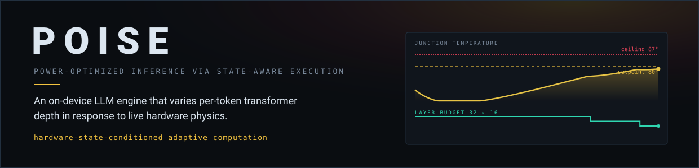
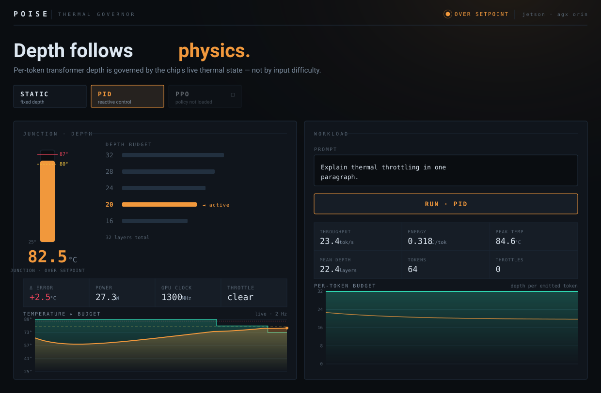

<div align="center">



<br>

[](pyproject.toml)
[](tests/)
[](#-off-device-by-design)
[](poise/engine/)
[](poise/control/)
[](poise/serving/)
[](#-license)

*Conditioning per-token compute on the temperature, power, and throttle state of the chip running it.*

</div>

---

## 🌡️ The problem

Run a fixed-depth LLM on a thermally-constrained edge device under sustained load and the
physics wins: the junction heats up, the hardware **throttles** the clock to protect the
silicon, and throughput **collapses** — exactly when you need it most.

POISE refuses that cliff. Instead of always executing all 32 transformer layers, it executes a
**variable number of layers per token** — a *layer budget* — chosen in real time from the
device's measured physical state. Under heat it **gracefully sheds depth** to hold a target
tokens/sec and cut energy-per-token, trading a small, **measured** amount of quality rather than
falling off a throttling cliff.

```
   fixed-depth model                          POISE (design goal)
   throughput                                 throughput
   ▲                                          ▲
   │████████▓▓▒▒░░       ← throttle cliff      │████████▓▓▓▓▓▓▓▓   ← depth shed gracefully
   │              ░░░░░                        │
   └──────────────────▶ heat                   └──────────────────▶ heat

   Schematic of the motivating problem + the design goal — NOT measured results.
   Whether POISE achieves this (and at what quality cost) is an empirical question
   answered only by the eval harness.
```

---

## 💡 The contribution

> ### Hardware-state-conditioned adaptive computation.

Existing adaptive-depth / early-exit methods condition execution depth on **input difficulty**
(token / sequence confidence, content). POISE instead conditions execution depth on **hardware
state** — it closes the loop between live device physics and per-token compute.

| Method | Conditions depth on |
| :--- | :--- |
| CALM · LayerSkip · AdaInfer · DASH · (early-exit literature) | **input difficulty** — confidence / entropy / content |
| **⚡ POISE (this work)** | **hardware state** — junction temp · power · GPU clock · throttle |

The two axes are orthogonal and composable; the **hardware-state loop is the contribution.**

- "Adaptive layer skipping" by itself is **not** claimed as novel — that field is crowded. The
  novelty is *what drives the depth decision*.
- The mechanism is literally **hardware-state-conditioned variable-depth execution**. Any
  "neuromorphic-inspired" analogy, if used at all, refers to exactly that mechanism — never a
  hardware/silicon claim.

> [!IMPORTANT]
> **No performance numbers appear in this README, the docs, or the paper until
> `poise/eval/report.py` has produced them with variance across multiple runs.** Every headline
> figure (energy %, quality %, throughput) is a measured output of the eval harness, reported
> with spread — never asserted ahead of measurement.

---

## 🔬 Measured so far — the go/no-go quality gate

> **Scope of this evidence.** This is the **step-3 quality gate** (the go/no-go), measured
> **on-device on the real model** — not the finished project. It is a **single on-device profiling
> run**, and the headline energy / throughput / quality comparison (build steps 5–11) is **not yet
> produced**. No headline number is claimed here; see [Still pending](#still-pending).

**Setup.** DeepSeek-R1-Distill-Llama-8B (32 layers, fp16) on an NVIDIA Jetson AGX Orin, 2026-07-24.
For each candidate depth *d*, we measure depth-*d* output vs the full-32 output over a 301-token
calibration set: **mean KL**, **perplexity**, and **top-1 agreement**. Reproducible with
`python3.10 -m poise.bringup --steps model,gate`; every row is persisted to the `quality_profile`
table in `data/results/poise.db`.

**Finding 1 — naive early-exit collapses.** On the stock model, dropping even 4 of 32 layers
destroys agreement with the full model. There is no "free" reduced depth: the usable `LAYER_MIN`
at KL ≤ 0.1 is 32. *This is the quality-collapse CLAUDE.md §9 warns about — measured, not assumed.*

| depth | mean KL ↓ | perplexity ↓ | top-1 agree ↑ |
| --: | --: | --: | --: |
| 16 | 7.24 | 615,631 | 1.7% |
| 20 | 6.30 | 278,734 | 7.6% |
| 24 | 5.20 | 109,711 | 13.0% |
| 28 | 3.91 | 34,098 | 14.6% |
| 32 | 0.00 | 1,959 | 100% |

**Finding 2 — LayerSkip adaptation recovers ≈3×.** A LoRA early-exit / self-distillation adapter
(CLAUDE.md §9 option a) re-calibrates the intermediate layers to the LM head, cutting KL roughly
threefold across the band while the full-depth anchor holds (depth-32 perplexity 1,959 → 1,874):

| depth | mean KL ↓ | perplexity ↓ | top-1 agree ↑ | vs. naive |
| --: | --: | --: | --: | :-- |
| 16 | 2.78 | 12,982 | 9.0% | KL −62% |
| 20 | 2.06 | 6,734 | 15.6% | KL −67% |
| 24 | 1.55 | 4,253 | 29.2% | KL −70% |
| 28 | 1.08 | 2,981 | 35.5% | KL −72% |
| 32 | 0.00 | 1,874 | 100% | anchor held |

**Honest read.** Adaptation works *directionally* — which is the entire premise of quality-preserving
variable depth. But this first adapter (500 steps, small corpus) does **not** yet clear a strict
usability bar: at depth 28 the adapted model still agrees with full-depth output only ~36% of the
time. A stronger adapter (more steps, larger public corpus) is training now. **The ≤2–3%
quality-loss target remains a hypothesis under test, not an achieved result** — exactly as
CLAUDE.md §9 requires.

<a name="still-pending"></a>
**Still pending before any headline claim:** real thermal calibration (RC fit from on-board sweeps —
currently synthetic), PPO policy training + on-board validation (no policy exists yet), and the
multi-seed energy / quality / throughput comparison from `eval/report.py`. Until those land, POISE's
headline numbers do not exist.

---

## 🧠 How it works — a two-tier controller

```
                    ┌──────────────────── telemetry/ ─────────────────────┐
                    │  jtop · tegrastats · mock  →  TelemetrySample        │
                    │  (temp · power · clock · util · throttled)           │
                    └─────────────────────────┬───────────────────────────┘
                                              │  live hardware state
                                              ▼
        control/  (POLICY)            ┌────────────────┐         engine/  (MECHANISM)
   ┌────────────────────────┐         │ BudgetAllocator│ budget  ┌───────────────────────────┐
   │  PID  +  PPO policy     │ ──────▶ │ static·pid·ppo │ ──────▶ │ adaptive_runner            │
   │  (obs == training obs)  │         │  🔒 TEMP_MAX    │ /token  │  layers 0..budget-1        │
   └────────────────────────┘         │   override      │         │  → early_exit → logits     │
              ▲                        └────────────────┘         │  + variable-depth KV cache │
              │ trained off-device                                └──────────────┬────────────┘
              │ against the simulator                                            │ tokens + per-token trace
   ┌──────────┴───────────────────────────────────┐                             ▼
   │  rl/  RC simulator (calibrated) + Gym env +   │                  eval/ · serving/ · storage/
   │  reward (quality from the step-3 gate) + PPO  │
   └───────────────────────────────────────────────┘
```

1. **PID feedback controller** — reactively maps a thermal error signal to a layer budget. PID
   lags slow thermal dynamics; that lag is the *motivation* for the second tier, not a bug.
2. **PPO-trained policy** — given the full hardware-state vector, learns an *anticipatory* budget
   allocation that acts ahead of throttling. Trained off-device against a calibrated RC thermal
   simulator with domain randomization, then validated on the real board.

🔒 **The engine is mechanism, `control/` is policy** — the runner contains no control logic, and
thermal safety (`TEMP_MAX`) overrides throughput, always.

---

## ✨ At a glance

- 🎚️ **Per-token variable depth** — clean per-layer loop with early-exit projection.
- 🌡️ **Closed on physics** — depth follows temperature / power / throttle, not content.
- 🧩 **Honest KV cache** — three documented strategies; constant-budget output is bit-identical.
- 🚦 **Two-tier control** — reactive PID + anticipatory PPO, with a hard thermal-safety override.
- 🔬 **A go/no-go quality gate** — depth→quality cost is *measured before* the controller is built.
- 🖥️ **Live dashboard + API** — FastAPI (`/v1/*`) + Prometheus + a React/Recharts UI.
- 🌐 **Universal** — auto-detects cuda/mps/cpu + jtop/nvml/mock; depth adapts to any model.
- 🧪 **Fully testable off-device** — 158 tests green with no GPU, no model, no board.

---

## 🖥️ The dashboard

The React/Recharts UI is a **thermal-governor instrument**: a single accent colour is
interpolated from live junction temperature, so the gauge, the depth-budget ladder, and the
page itself *warm* as the chip heats. The junction gauge and the depth ladder move in
opposition — heat rises on the left, depth sheds on the right — making the whole thesis
(`temp ↑ ⇒ depth ↓`) legible at a glance.

<div align="center">



<sub><b>Vector rendering</b> of the live dashboard, captured at a “governor holding over setpoint” moment (PID mode, depth shed to 20). Derived from the app's own thermochromic logic — not a mockup, not measured performance.</sub>

</div>

> **Try it live:** the design is explorable as an [interactive preview](https://claude.ai/code/artifact/602ad948-73f1-4149-b6a6-7efcf7109498) —
> drag the thermal load and watch depth shed. Or run it for real: `bash scripts/serve.sh`, then
> `cd dashboard && npm run dev`.

---

## 🚀 Quickstart

```bash
# 1. Install the lightweight core (no torch — runs fully off-device)
pip install -r requirements.txt

# 2. Prove it works in mock mode
pytest                                  # green, no board required

# 3. Universal bring-up — auto-detects device + telemetry, runs profile/deps/gate/eval.
#    Works on Jetson, NVIDIA GPU box, Apple Silicon, or CPU-only.
bash scripts/bringup.sh                              # uses your configured model
bash scripts/bringup.sh --model sshleifer/tiny-gpt2  # validate the WHOLE pipeline on CPU

# 4. Serve the API + live dashboard (real engine on-device, mock engine off-device)
bash scripts/serve.sh                   # FastAPI on :8000, Prometheus at /metrics
cd dashboard && npm install && npm run dev   # → http://localhost:5173

# For on-device use, copy and fill in credentials (never committed):
cp .env.example .env                    # HF_TOKEN; POISE_DEVICE/TELEMETRY stay 'auto'
```

> **Universal:** `POISE_DEVICE=auto` resolves cuda → mps → cpu; `POISE_TELEMETRY_BACKEND=auto`
> picks jtop → nvml → mock; and the layer-budget config rescales to **any** decoder-only
> model's actual layer count. See [`docs/bringup.md`](docs/bringup.md).

---

## 🧊 Off-device by design

Every hardware-touching module ships a **mock path**, so the whole stack is developable, testable,
and demoable without the Jetson:

| Concern | On the board | Off-device (laptop / CI / Kaggle) |
| :--- | :--- | :--- |
| Device | `auto` → cuda (Jetson/GPU) / mps | `auto` → cpu |
| Telemetry | `auto` → jtop / nvml / tegrastats | `auto` → mock thermal curve |
| Model | any HF decoder-only (depth auto-adapts) | tiny model on CPU, or mock engine |
| Thermal model | calibrated RC params | clearly-labeled **placeholder** params |
| RL training | — | RC simulator + Gymnasium env (no model) |
| Serving / dashboard | real `AdaptiveRunner` | mock engine reusing the **real** control loop |
| Heavy deps (`torch`, `transformers`, `faiss`, `llama.cpp`) | installed | optional extras |

---

## 🗺️ Build order

Built in dependency order (full spec in [`CLAUDE.md`](CLAUDE.md) §5). **Step 3 is a go/no-go gate.**

| | Stage | | | Stage |
| :-- | :-- | :-- | :-- | :-- |
| 0 | Scaffold · config · storage | | 8 | PPO training (Kaggle) |
| 1 | Telemetry (+ mock) | | 9 | PPO on-board validation |
| 2 | Engine: load + early-exit | | 10 | Fixed-depth baselines |
| **3** | **🚧 GATE — depth→quality profile** | | 11 | Eval harness + variance report |
| 4 | Adaptive runner + KV cache | | 12 | Serving + metrics + dashboard |
| 5 | Calibration → RC params | | 13 | RAG demo (synthetic only) |
| 6 | Simulator + env + reward | | 14 | Repro packaging |
| 7 | PID + budget allocator | | | |

> 🚧 **The gate (step 3)** measures the depth→quality cost *before* the controller is built. The
> ≤2–3% quality-loss target is a **hypothesis to be measured, not an assumption** — see
> [`docs/novelty.md`](docs/novelty.md) and `CLAUDE.md` §9 for the honest options if it doesn't hold.

---

## 📟 Run-book

<details>
<summary><b>Calibration → training → benchmark → serve</b> (click to expand)</summary>

```bash
# Calibration sweep (on the Jetson) → fits RC params + depth→power map
bash scripts/run_calibration.sh

# PPO training (Kaggle, off-device against the simulator)
#   open scripts/train_ppo_kaggle.ipynb
#   → trains the policy, sweeps reward weights, reports the converged depth distribution

# Stress benchmark / headline comparison (static-full-32 · static×2 · pid · ppo)
bash scripts/run_benchmark.sh

# Serve the API + Prometheus metrics
bash scripts/serve.sh                 # /health  /v1/generate  /v1/telemetry  /metrics

# Live dashboard — temp / power / current-budget / tok-s + per-token budget trace
cd dashboard && npm install && npm run dev
```

</details>

---

## 📂 Repository layout

```
poise/
├── telemetry/     # TelemetrySample + jtop/tegrastats readers + mock
├── engine/        # model_loader · early_exit · adaptive_runner · kv_cache   (mechanism)
├── control/       # pid · budget_allocator · policy                           (policy)
├── rl/            # simulator · env · reward · domain_random · train_ppo
├── calibration/   # quality_profile (the GATE) · sweep · fit
├── baselines/     # static_llamacpp (Q4_K_M) · static_trtllm   (fixed-depth only)
├── eval/          # benchmark · quality · report   (the only place numbers are produced)
├── serving/       # FastAPI api · routes · Prometheus metrics
├── storage/       # SQLite schema + migrations + accessors
└── rag/           # synthetic FAISS index + LangGraph demo   (engine as a black box)
```

See [`docs/architecture.md`](docs/architecture.md) for the data-flow diagram and full module map,
and [`docs/novelty.md`](docs/novelty.md) for the prior-art positioning.

---

## 🔒 Governance

- **Personal portfolio / research project.** Assumes **personal IP ownership** of all code.
- **No company / proprietary data anywhere.** The RAG demo uses only public or synthetic data — a
  synthetic-doc generator ships with the repo.
- **No secrets in the repo.** All tokens / keys via `.env` (git-ignored).
- **No fabricated results.** Calibration params stay labeled *placeholder* until fit from real
  data; headline numbers exist only as eval outputs with variance.

---

## 📜 License

Proprietary — personal IP. See [`CLAUDE.md`](CLAUDE.md) §1 governance.

<div align="center">
<sub>POISE — depth follows physics.</sub>
</div>
